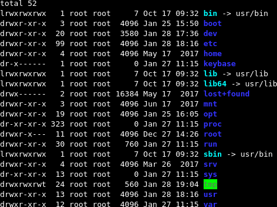

# shell-utils
Some shell utility tools

I have developped these tools for my personnal use. Maybe someone else find them usefull.

You should feel free to use them but if you improve them, please let me know so everyone can benefit from it.

## termshot

This tool takes a "screenshot" of the output of a cli command (including prompted messages and typed answers).

For example

```shell
termshot ls -l --color=auto /
```

gives this result:



The image is saved in the `${HOME}/Pictures` folder and is timestamped.

It relies on [Daniel J. Bernstein's ptybandage](https://jdebp.eu/Softwares/djbwares/bernstein-ptyget.html), [aha - Ansi HTML Adapter](https://github.com/theZiz/aha), [phantomjs](http://phantomjs.org/) and [ImageMagik's convert](https://www.imagemagick.org/script/convert.php) to work.


## python-version-switcher

This tool tries to resolve the problem of having both python2 and python3 installed and having python scripts that do not force the version they use, eg. that starts with
```
#!/usr/bin/python
```
or just make use of `python`.

Just copy this script in `/usr/bin/` and update python's symbolic links to point on it:
```
sudo wget "https://raw.githubusercontent.com/pierrekilly/shell-utils/master/python-version-switcher/python-version-switcher.sh" -O /usr/bin/python-version-switcher.sh
for link in idle pydoc python python-config; do sudo rm -f "$link"; sudo ln -s python-version-switcher.sh "$link"; done
```

Then, when running a python program, you can specify which version of python you want to run it against by setting the `PYTHON_VERSION` environement variable:
```
PYTHON_VERSION=2 ./my_wonderfull_program
```

and it will run it against the right version of python.

If no `PYTHON_VERSION` is set, it uses python3 by default.

